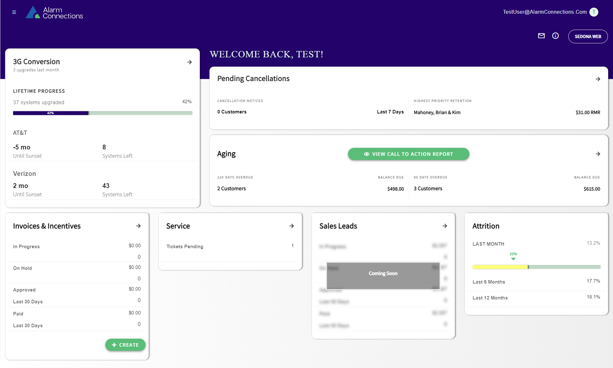

# The Partnership Connection x Customer Care Dashboard



## Overview

This is a software application powered by .NET Core and Angular that provides the functionality for The Partnership Connection and Customer Care Dashboard for Alarm Connections.

## Table of contents

*[General Info](#general-info)
*[Technologies](#technologies)
*[Setup](#setup)

## General info
This project is the API and UI for The Partnership Connection and the Customer Care Dashboard.

## Technologies
Project is created with:
* SQL Server 2016
* .Net Core 3.1
* Angular 11

## Setup
To run this project, clone this repo to your desktop, cd into the angular-src folder, and run `npm install` to install the dependencies:

```
$ cd angular-src
$ npm install
$ ng serve
```

## Helpful Links

* [Alarm Connections](https://www.alarmconnections.com/)
* [The Partnership Connection](https://www.thepartnershipconnection.com/login)

- - -
